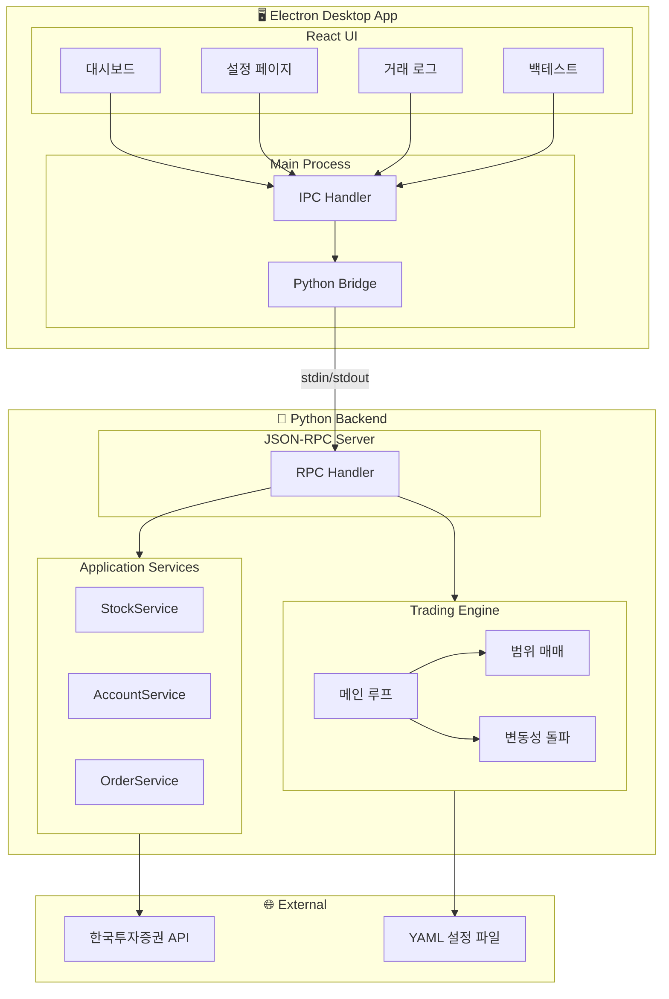
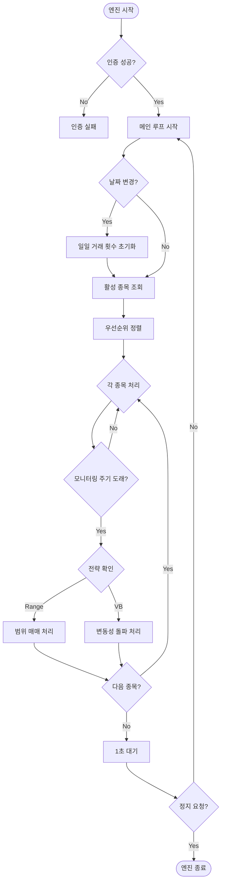
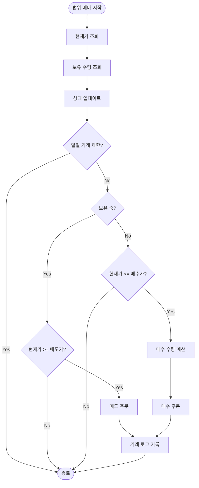
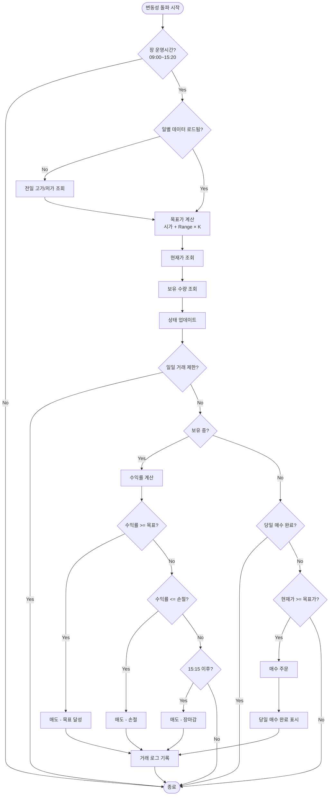
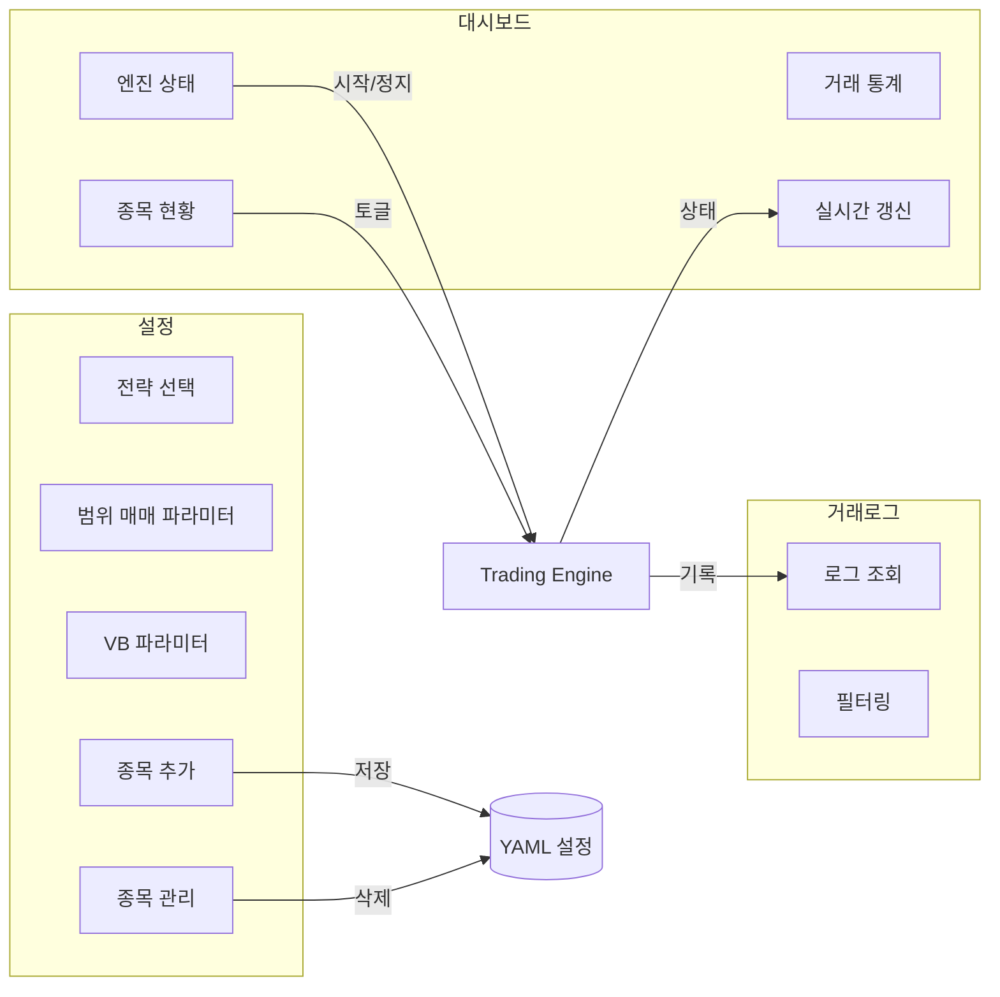
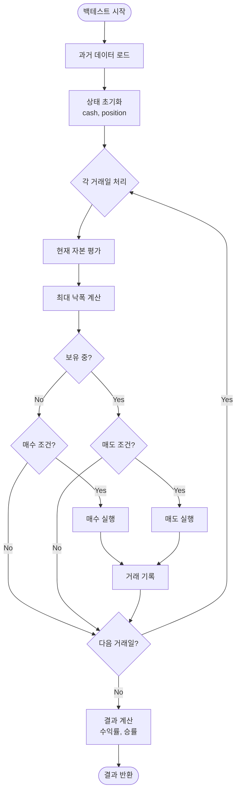

# 한국투자증권 OpenAPI 주식 자동매매 프로그램

한국투자증권 OpenAPI를 활용한 Python 주식 자동매매 **데스크톱** 프로그램입니다.

## 기능

- **시세 조회**: 현재가, 호가, 일별 시세, 분봉 시세
- **계좌 조회**: 잔고, 보유종목, 주문가능금액
- **주문**: 매수/매도 (시장가/지정가)
- **주문 내역**: 당일 주문/체결 조회
- **자동매매 엔진**: YAML 설정 기반 자동 매매
- **데스크톱 관리 앱**: Electron 기반 GUI (종목 관리, 엔진 제어, 거래 로그)
- **백테스트**: 과거 데이터 기반 전략 시뮬레이션 (일봉/분봉)

## 문서

| 문서 | 내용 |
|------|------|
| [설치 가이드](docs/INSTALL.md) | 배포된 앱 설치 및 설정 방법 |
| [빌드 가이드](docs/BUILD.md) | 소스 코드에서 빌드하는 방법 |

## 빠른 시작

### 배포된 앱 사용 (일반 사용자)

1. `AutoStock Setup x.x.x.exe` 다운로드 및 설치
2. 설치 후 `resources/config/.env` 파일 생성
3. API Key 및 계좌번호 설정
4. 앱 실행

자세한 내용: [설치 가이드](docs/INSTALL.md)

### 소스에서 빌드 (개발자)

```bash
# 의존성 설치
pip install -r requirements.txt
cd electron && npm install && cd renderer && npm install && cd ../..

# 전체 빌드
python build.py
```

자세한 내용: [빌드 가이드](docs/BUILD.md)

## 설정

### 환경변수 (.env)

```env
APP_KEY=your_app_key
APP_SECRET=your_app_secret
ACCOUNT_NO=12345678-01
ENV=dev  # dev: 모의투자, prod: 실전투자
```

**파일 위치**:
- 개발: 프로젝트 루트 `.env`
- 설치 앱: `resources/config/.env`

## 사용법

### CLI 명령어

```bash
# 현재가 조회
python main.py price 005930

# 호가 조회
python main.py asking 005930

# 일별 시세 (최근 10일)
python main.py daily 005930 -n 10

# 계좌 잔고 조회
python main.py balance

# 주문가능금액 조회
python main.py deposit

# 매수 주문 (지정가: 70,000원에 10주)
python main.py buy 005930 10 70000

# 매수 주문 (시장가: 가격을 0으로)
python main.py buy 005930 10 0

# 매도 주문
python main.py sell 005930 5 71000

# 당일 주문 내역 조회
python main.py orders

# 특정일 주문 내역 조회
python main.py orders -d 20251216

# 백테스트 (Mock 데이터)
python main.py backtest 005930 20241101 20241130 --mock -s volatility_breakout

# 백테스트 (실제 API 데이터)
python main.py backtest 005930 20241101 20241130 -c 1000000 -s range_trading --buy-price 50000 --sell-price 55000
```

### Python 코드에서 사용

```python
from src.factory import KISClient

# 클라이언트 초기화 (.env에서 설정 로드)
client = KISClient()
client.authenticate()

# 시세 조회
price = client.stock.get_price("005930")
print(f"삼성전자 현재가: {price.current_price:,}원")

# 호가 조회
asking = client.stock.get_asking_price("005930")
print(f"매수호가1: {asking.buy_prices[0]:,}원")

# 잔고 조회
balance = client.account.get_balance()
for h in balance.holdings:
    print(f"{h.stock_name}: {h.quantity}주, 수익률 {h.profit_rate}%")

# 매수 주문 (지정가)
result = client.order.buy("005930", quantity=1, price=70000)
if result.success:
    print(f"주문번호: {result.order_no}")

# 매도 주문 (시장가)
result = client.order.sell("005930", quantity=1, price=0)
```

### 직접 설정 주입

```python
from src.factory import KISClient
from src.infrastructure.config import Config

# 환경변수 대신 직접 설정
config = Config.create(
    app_key="your_app_key",
    app_secret="your_app_secret",
    account_no="12345678-01",
    is_production=False,  # True: 실전, False: 모의
)

client = KISClient(config)
```

## 프로젝트 구조

```
auto-stock/
├── .env                          # 환경변수
├── main.py                       # CLI 인터페이스
├── build.py                      # 전체 빌드 스크립트
├── requirements.txt
│
├── config/
│   └── trading_config.yaml       # 자동매매 설정
│
├── electron/                     # Electron 데스크톱 앱
│   ├── package.json              # Electron 설정
│   ├── main/
│   │   ├── main.js               # 메인 프로세스
│   │   ├── preload.js            # IPC 브릿지
│   │   └── python-bridge.js      # Python 통신
│   └── renderer/                 # React UI
│       ├── package.json
│       └── src/
│           ├── App.jsx
│           └── pages/
│               ├── Dashboard.jsx # 대시보드
│               ├── Config.jsx    # 설정
│               ├── Logs.jsx      # 거래 로그
│               └── Backtest.jsx  # 백테스트
│
├── src/
│   ├── factory.py                # 의존성 주입 팩토리
│   │
│   ├── ipc/                      # IPC 핸들러
│   │   ├── main.py               # JSON-RPC 서버
│   │   └── handler.py            # RPC 핸들러
│   │
│   ├── domain/                   # 도메인 계층
│   │   ├── models.py             # 데이터 모델
│   │   └── interfaces.py         # 인터페이스 정의
│   │
│   ├── infrastructure/           # 인프라 계층
│   │   ├── config.py             # 설정 관리
│   │   ├── http_client.py        # HTTP 클라이언트
│   │   └── auth.py               # 인증 처리
│   │
│   ├── application/              # 애플리케이션 계층
│   │   ├── stock_service.py      # 시세 서비스
│   │   ├── account_service.py    # 계좌 서비스
│   │   └── order_service.py      # 주문 서비스
│   │
│   ├── engine/                   # 자동매매 엔진
│   │   ├── config_parser.py      # 설정 파서
│   │   └── trading_engine.py     # 트레이딩 엔진
│   │
│   └── backtest/                 # 백테스트 모듈
│       ├── models.py             # 결과 모델
│       ├── strategies.py         # 전략 시뮬레이터
│       ├── data_provider.py      # 데이터 제공자
│       └── engine.py             # 백테스트 엔진
│
└── tests/                        # 테스트 (121개)
    ├── conftest.py
    ├── test_models.py
    ├── test_config.py
    └── ...
```

## 아키텍처

### SOLID 원칙 적용

| 원칙 | 적용 |
|------|------|
| **SRP** | 클래스별 단일 책임 (Config, Auth, HttpClient 분리) |
| **OCP** | 인터페이스 기반 설계로 확장에 열림 |
| **LSP** | 구현체 교체 가능 (Mock 테스트) |
| **ISP** | 서비스 인터페이스 분리 (Stock, Account, Order) |
| **DIP** | 추상화 의존, Factory 패턴 적용 |

### 계층 구조

```
┌─────────────────────────────────────┐
│           main.py (CLI)             │
└─────────────────────────────────────┘
                  │
┌─────────────────────────────────────┐
│        factory.py (DI Container)    │
└─────────────────────────────────────┘
                  │
┌─────────────────────────────────────┐
│    application/ (서비스 계층)        │
│  - StockService                     │
│  - AccountService                   │
│  - OrderService                     │
└─────────────────────────────────────┘
                  │
┌─────────────────────────────────────┐
│    domain/ (도메인 계층)             │
│  - Models (DTO)                     │
│  - Interfaces (추상화)              │
└─────────────────────────────────────┘
                  │
┌─────────────────────────────────────┐
│    infrastructure/ (인프라 계층)     │
│  - Config, Auth, HttpClient         │
└─────────────────────────────────────┘
```

## 테스트

```bash
# 전체 테스트 실행
python -m pytest tests/ -v

# 특정 테스트 파일 실행
python -m pytest tests/test_stock_service.py -v

# 커버리지 포함
python -m pytest tests/ -v --cov=src --cov-report=term-missing
```

### 테스트 커버리지

| 모듈 | 커버리지 |
|------|----------|
| domain/models.py | 90% |
| application/ | 85-92% |
| engine/config_parser.py | 91% |
| backtest/ | 81-98% |
| **전체** | **68%** |

총 121개 테스트 케이스

## 주의사항

- **API 호출 제한**: 초당 20회 제한 준수
- **토큰 발급 제한**: 1분에 1회
- **장 운영시간**: 09:00~15:30 (주문 가능)
- **실전/모의 구분**: `.env`의 `ENV` 값으로 전환
- **API 키 보안**: `.env` 파일은 절대 커밋하지 마세요

## 주요 종목코드

| 종목명 | 코드 |
|--------|------|
| 삼성전자 | 005930 |
| SK하이닉스 | 000660 |
| LG에너지솔루션 | 373220 |
| 삼성바이오로직스 | 207940 |
| 현대차 | 005380 |
| 기아 | 000270 |
| NAVER | 035420 |
| 카카오 | 035720 |
| KODEX 200 | 069500 |
| KODEX 코스닥150 | 229200 |

## 자동매매 엔진

### 데스크톱 앱 실행

```bash
# 개발 모드 실행
cd electron && npm run dev
```

### 데스크톱 앱 화면

| 페이지 | 기능 |
|--------|------|
| **대시보드** | 엔진 상태, 종목 현황, 실시간 모니터링 |
| **설정** | 종목 추가/삭제, 활성화 토글 |
| **거래로그** | 매수/매도 기록 조회 |
| **백테스트** | 전략 시뮬레이션, 차트 분석 |

### YAML 설정 파일

`config/trading_config.yaml`:

```yaml
settings:
  default_interval: 60    # 기본 모니터링 주기 (초)
  max_daily_trades: 10    # 일일 최대 거래 횟수

stocks:
  # 범위 매매 전략
  - code: "005930"
    name: "삼성전자"
    strategy: "range_trading"   # 전략 선택
    max_amount: 1000000
    buy_price: 52000            # 매수 희망가 (이하일 때 매수)
    sell_price: 58000           # 매도 희망가 (이상일 때 매도)
    enabled: true
    priority: 1

  # 변동성 돌파 전략
  - code: "000660"
    name: "SK하이닉스"
    strategy: "volatility_breakout"
    max_amount: 500000
    enabled: true
    priority: 2
    vb_params:
      k: 0.5                    # 변동성 계수
      target_profit_rate: 2.0   # 목표 수익률 (%)
      stop_loss_rate: -2.0      # 손절 수익률 (%)
      sell_at_close: true       # 장 마감 전 매도
```

## 거래 전략

### 1. 범위 매매 (Range Trading)

설정한 가격 범위에서 매수/매도하는 전략

| 파라미터 | 설명 |
|----------|------|
| `buy_price` | 매수 희망가 (이하일 때 매수) |
| `sell_price` | 매도 희망가 (이상일 때 매도) |

**매매 로직:**
- 현재가 ≤ buy_price → 매수
- 현재가 ≥ sell_price → 매도

### 2. 변동성 돌파 (Volatility Breakout)

래리 윌리엄스의 변동성 돌파 전략

**목표가 계산:**
```
목표가 = 당일시가 + (전일고가 - 전일저가) × K
```

| 파라미터 | 기본값 | 설명 |
|----------|--------|------|
| `k` | 0.5 | 변동성 계수 (0.1~1.0) |
| `target_profit_rate` | 2.0 | 목표 수익률 (%) 도달 시 매도 |
| `stop_loss_rate` | -2.0 | 손절 수익률 (%) 도달 시 매도 |
| `sell_at_close` | true | 장 마감 전(15:15) 자동 매도 |

**매매 로직:**
- 현재가 ≥ 목표가 → 매수 (당일 1회)
- 수익률 ≥ target_profit_rate → 매도
- 수익률 ≤ stop_loss_rate → 손절 매도
- 15:15 이후 → 자동 매도 (sell_at_close=true)

**K값 가이드:**
| K값 | 특성 |
|-----|------|
| 0.3~0.4 | 공격적 (진입 기회 多, 손절 多) |
| 0.5 | 표준 |
| 0.6~0.7 | 보수적 (진입 기회 少, 승률 高) |

### 우선순위 (Priority)

종목별 `priority` 값으로 주문 처리 순서를 지정합니다.

| priority | 설명 |
|----------|------|
| 1 | 가장 먼저 처리 |
| 2, 3, ... | 순차적으로 처리 |
| 100 (기본값) | 우선순위 미지정 시 |

**왜 우선순위가 필요한가?**
- 주문가능금액이 한정적일 때, 여러 종목이 동시에 매수 조건을 충족하면 모든 주문이 체결되지 않음
- 우선순위가 높은 종목부터 주문하여 중요한 종목의 체결 확률을 높임

```yaml
stocks:
  - code: "005930"
    name: "삼성전자"
    priority: 1           # 1순위: 가장 먼저 주문
    ...
  - code: "000660"
    name: "SK하이닉스"
    priority: 2           # 2순위
    ...
  - code: "035420"
    name: "NAVER"
    priority: 3           # 3순위
    ...
```

### 자동매매 로직

**공통:**
1. **모니터링**: 설정된 주기마다 현재가 조회
2. **우선순위**: priority 순으로 종목 처리
3. **거래 제한**: 일일 최대 거래 횟수 초과 시 중단

**전략별 로직은 위의 [거래 전략](#거래-전략) 섹션 참조**

## 기능 흐름도

### 전체 시스템 아키텍처



### 자동매매 엔진 흐름



### 범위 매매 전략 흐름



### 변동성 돌파 전략 흐름



### Desktop UI 흐름



### IPC 메서드 (JSON-RPC)

| 메서드 | 설명 |
|--------|------|
| `engine.start` | 엔진 시작 |
| `engine.stop` | 엔진 정지 |
| `engine.pause` | 일시정지 |
| `engine.resume` | 재개 |
| `engine.status` | 상태 조회 |
| `stocks.list` | 종목 목록 |
| `stocks.add` | 종목 추가 |
| `stocks.update` | 종목 수정 |
| `stocks.delete` | 종목 삭제 |
| `stocks.toggle` | 활성화 토글 |
| `logs.get` | 거래 로그 |
| `backtest.run` | 백테스트 실행 |
| `config.get` | 설정 조회 |
| `config.save` | 설정 저장 |

## 백테스트 (Backtest)

과거 데이터를 기반으로 거래 전략의 성과를 시뮬레이션합니다.

### 데이터 단위

| 단위 | 설명 | 용도 |
|------|------|------|
| **일봉** | 일별 OHLCV 데이터 | 빠른 시뮬레이션, 중장기 전략 |
| **분봉** | 분 단위 OHLCV 데이터 | 정밀한 시뮬레이션, 단타/스캘핑 전략 |

분봉 백테스트는 장 시간(09:00~15:30) 동안 1분 단위로 매매 조건을 체크하여 더 현실적인 시뮬레이션을 제공합니다.

### CLI 사용법

```bash
# 기본 형식
python main.py backtest <종목코드> <시작일> <종료일> [옵션]

# 범위 매매 전략 백테스트
python main.py backtest 005930 20241101 20241130 \
    -c 1000000 \
    -s range_trading \
    --buy-price 50000 \
    --sell-price 55000

# 변동성 돌파 전략 백테스트
python main.py backtest 005930 20241101 20241130 \
    -c 1000000 \
    -s volatility_breakout \
    --k 0.5 \
    --target-profit 2.0 \
    --stop-loss -2.0

# Mock 데이터로 테스트 (API 키 불필요)
python main.py backtest 005930 20241101 20241130 --mock -s volatility_breakout
```

### 데스크톱 앱 백테스트

데스크톱 앱에서 백테스트를 실행할 수 있습니다:

1. 앱 실행 후 "백테스트" 메뉴 클릭
2. 종목코드, 기간, 자본금 입력
3. 전략 선택 (범위 매매 / 변동성 돌파)
4. 데이터 단위 선택 (일봉 / 분봉)
5. "백테스트 실행" 클릭

결과 화면에서 다음을 확인할 수 있습니다:
- 수익률, 승률, 최대 낙폭
- 주가 차트 (매수/매도 포인트 표시)
- 거래 내역 테이블

### 백테스트 옵션

| 옵션 | 기본값 | 설명 |
|------|--------|------|
| `-c, --capital` | 1,000,000 | 초기 자본금 |
| `-s, --strategy` | range_trading | 전략 (range_trading, volatility_breakout) |
| `--buy-price` | 0 | [Range] 매수 희망가 |
| `--sell-price` | 0 | [Range] 매도 희망가 |
| `--k` | 0.5 | [VB] K값 |
| `--target-profit` | 2.0 | [VB] 목표 수익률 (%) |
| `--stop-loss` | -2.0 | [VB] 손절 수익률 (%) |
| `--mock` | - | Mock 데이터 사용 (API 불필요) |

### 결과 예시

```
========================================
백테스트 결과 요약
========================================
종목: 삼성전자 (005930)
기간: 20241101 ~ 20241130
전략: volatility_breakout
----------------------------------------
초기 자본: 1,000,000원
최종 자본: 1,052,300원
총 손익: 52,300원 (+5.23%)
----------------------------------------
총 거래: 8회
수익 거래: 5회
손실 거래: 3회
승률: 62.5%
최대 낙폭: 3.21%
========================================

[거래 내역]
  1. 20241104 | 매수 | 52,000원 x 19주 | 손익: 0원 (0.00%) | 목표가(52,000원) 돌파 (K=0.5)
  2. 20241104 | 매도 | 53,040원 x 19주 | 손익: 19,760원 (2.00%) | 익절
  ...
```

### Python 코드에서 사용

```python
from src.backtest.engine import BacktestEngine
from src.backtest.data_provider import MockHistoricalDataProvider, generate_sample_data

# 1. 샘플 데이터 생성 (또는 실제 데이터 제공자 사용)
sample_data = generate_sample_data("20241101", "20241130", base_price=50000)
provider = MockHistoricalDataProvider(sample_data)

# 2. 백테스트 엔진 생성
engine = BacktestEngine(provider)

# 3. 백테스트 실행
result = engine.run(
    stock_code="005930",
    start_date="20241101",
    end_date="20241130",
    initial_capital=1000000,
    strategy="volatility_breakout",
    strategy_params={
        "k": 0.5,
        "target_profit_rate": 2.0,
        "stop_loss_rate": -2.0,
        "sell_at_close": True,
    },
    stock_name="삼성전자",
)

# 4. 결과 확인
print(result.get_summary())
print(f"수익률: {result.total_return_rate:.2f}%")
print(f"승률: {result.win_rate:.1f}%")
```

### 백테스트 흐름



## 트러블슈팅

### Authentication failed 에러

웹 UI에서 `시작` 버튼 클릭 시 `Authentication failed` 에러가 발생하는 경우:

```
2025-12-16 14:55:24,457 [ERROR] Authentication failed
```

**원인**: API Key가 해지되었거나 만료된 경우

**해결 방법**:
1. [KIS Developers](https://apiportal.koreainvestment.com/)에 로그인
2. 새 API Key 발급 (APP KEY, APP SECRET)
3. `.env` 파일 업데이트:
   ```env
   APP_KEY=new_app_key
   APP_SECRET=new_app_secret
   ```
4. 웹 서버 재시작 후 다시 시도

### 토큰 발급 제한 에러

```
EGW00133: 토큰 발급 제한
```

**원인**: 토큰은 1분에 1회만 발급 가능

**해결 방법**: 60초 이상 대기 후 재시도

### API 호출 제한

**원인**: 초당 20회 API 호출 제한 초과

**해결 방법**: 모니터링 주기(`interval`)를 늘려서 API 호출 빈도 감소

## 라이선스

MIT License
